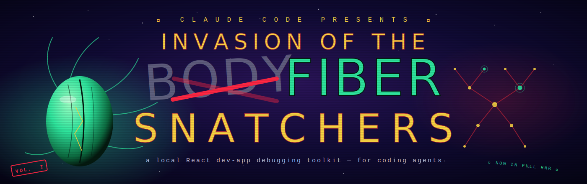

<p align="center">
  
</p>

# Fiber Snatcher

> *Give Claude a proper hands-and-eyes handle into your local React dev app.*

**Slug:** `invasion-of-the-fiber-snatchers` · **CLI:** `fiber-snatcher` · **Runtime global:** `window.__snatcher__` · **Status:** V1

A local-only debugging toolkit that gives Claude Code (or any coding agent) first-class access to a running Next.js / React dev app:

- **Inspect** — read state/props/hooks for any component by CSS selector
- **Drive** — click/type like a user *and* push actions directly into your store
- **Bypass auth** — one-line header check, so Claude doesn't get stuck on a login form
- **Unify logs** — browser console + dev-server stdout + failed network requests in one JSONL file
- **Assert visually** — deterministic screenshots to a predictable path

## Before / after

**Before** — a typical Claude turn inspecting component state:

```
1. Claude: browser_evaluate("Object.keys(window.__REACT_DEVTOOLS_GLOBAL_HOOK__?.renderers || {}).length")
2. Claude: browser_evaluate("/* 40 lines walking __reactFiber$ */ …")
3. Claude: parses raw object, guesses which ancestor owns the state
4. Claude: another browser_evaluate to read specific hooks
5. Result: 4 tool calls, no uniform shape, no error-grouping, re-rolled next turn
```

**After** — same task with Fiber Snatcher:

```sh
fiber-snatcher state '[data-testid="cart"]'
# {
#   "selector": "[data-testid=\"cart\"]",
#   "ancestors": [{ "component": "CartProvider", "state": {...}, "hooks": [...] }],
#   "page": "/dashboard"
# }
```

One call, clean shape, reproducible.

## Documentation

| Read this…                                | When…                                                         |
| ----------------------------------------- | ------------------------------------------------------------- |
| [`USAGE.md`](./USAGE.md)                  | Setting up Fiber Snatcher in a target project (includes auth-bypass code samples for NextAuth / custom proxy / no-auth) |
| [`CLAUDE.md`](./CLAUDE.md)                | Writing an agent that uses the CLI — operating rules, when to use, when not to |
| [`docs/ARCHITECTURE.md`](./docs/ARCHITECTURE.md) | Understanding internals, extending the daemon, writing new adapters |
| [`docs/TROUBLESHOOTING.md`](./docs/TROUBLESHOOTING.md) | Something isn't working — error codes and recovery steps |
| [`CHANGELOG.md`](./CHANGELOG.md)          | Tracking what's in V1 vs V1.1 vs V2                           |

## Architecture at a glance

```
  Claude ───MCP calls──▶ playwright-mcp, chrome-devtools-mcp, next-devtools-mcp
      │
      └──Bash──▶ fiber-snatcher CLI (Bun)
                     │
                     │ unix socket (sub-50ms)
                     ▼
                 daemon.ts (long-running)
                     │
                     ├─▶ Playwright persistent Chromium ──▶ Target Next.js app
                     │                                         │
                     │                                         ▼
                     │                                  window.__snatcher__
                     │                                  (state, dispatch, log, register)
                     │
                     └─▶ .fiber-snatcher/
                           logs/*.jsonl    (unified: cdp-console + cdp-network + react + browser)
                           shots/*.png
                           last-run.json   (structured outcome of every command)
                           auth/dev-key    (32-byte hex, gitignored, mode 0600)
```

Full box-drawing diagram and design notes: [`docs/ARCHITECTURE.md`](./docs/ARCHITECTURE.md).

## Quick start

```sh
# Install the CLI, once per machine
git clone https://github.com/alcatraz627/invasion-of-the-fiber-snatchers ~/Code/Claude/invasion-of-the-fiber-snatchers
cd ~/Code/Claude/invasion-of-the-fiber-snatchers
~/.bun/bin/bun install
bash scripts/install.sh                       # symlinks fiber-snatcher → ~/.local/bin
npx playwright install chromium               # one-time browser download

# Set it up in a target project
cd ~/path/to/your-nextjs-app
fiber-snatcher init                            # scaffolds .fiber-snatcher/, merges .mcp.json
# …wire expose.ts + auth bypass per USAGE.md…
npm run dev &                                  # your dev server
fiber-snatcher start                           # opens headful Chromium, attaches debug surface
fiber-snatcher doctor                          # verifies the loop
fiber-snatcher state '[data-testid="cart"]'
```

## Why this exists

Three MCP servers cover most browser-control needs for a coding agent:

- `playwright-mcp` — drive (click/fill/navigate)
- `chrome-devtools-mcp` — debug (traces, performance, deep console)
- `next-devtools-mcp` — framework-level query (build errors, routes, server actions)

They're excellent but they leave three gaps for a React dev loop:

1. **Deterministic state access** — every command ends up hand-rolling `evaluate_script` that walks `__reactFiber$…` keys. Fragile, verbose, repeated every turn.
2. **Auth friction** — Claude wastes 1–5 turns per session battling a login form.
3. **Signal fragmentation** — an app crash scatters evidence across browser console, Next.js dev stdout, and the failed-XHR list. Claude reads all three serially, often missing the correlation.

Fiber Snatcher closes the gaps with a tiny runtime inject, a local-only auth-bypass contract, and a log aggregator that merges everything into one JSONL file Claude can `grep` or diff.

## Prerequisites

- **macOS** — V1 is macOS-first (Linux should work; untested). Windows needs V2 (Unix socket replacement).
- **Bun** ≥ 1.3 at `~/.bun/bin/bun` — the toolkit runs on Bun for fast cold-starts.
- **Node.js** ≥ 20 — for the target project's own dev server.
- **A Next.js app** — V1 is Next-focused; other React setups work for state/drive but lose next-devtools-mcp integration.

## V1 command surface

| Command                         | What it does                                                              |
| ------------------------------- | ------------------------------------------------------------------------- |
| `fiber-snatcher init`           | Scaffold `.fiber-snatcher/` in target project; merge `.mcp.json`          |
| `fiber-snatcher start`          | Launch persistent headful Chromium + IPC daemon + log aggregator          |
| `fiber-snatcher stop`           | Graceful shutdown (browser, daemon, socket)                               |
| `fiber-snatcher status`         | Is the daemon running? Current URL, adapters, recent log sample           |
| `fiber-snatcher doctor`         | Probe battery — each step reported independently                          |
| `fiber-snatcher state [sel]`    | React state/props/hooks for fiber at CSS selector (flags: `--full`, `--shallow`) |
| `fiber-snatcher components <n>` | List mounted fibers by displayName (flags: `--count`, `--shallow`, `--full`, `--limit`) |
| `fiber-snatcher portal <id>`    | Inspect `#<id>` children + React portal sources (flag: `--dom-only`, `--count`) |
| `fiber-snatcher count <sel>`    | `querySelectorAll(sel).length` shortcut                                   |
| `fiber-snatcher dispatch`       | Pipe JSON on stdin; routed through `__snatcher__.dispatch`                |
| `fiber-snatcher atoms [name]`   | Jotai-aware: list / get / set / watch atoms by `debugLabel`               |
| `fiber-snatcher queries [sub]`  | TanStack Query: list / get / invalidate / refetch / reset / setData       |
| `fiber-snatcher click <sel>`    | Playwright click (real input pipeline, fires React events)                |
| `fiber-snatcher fill <sel> <v>` | Playwright fill — dispatches input+change with bubbling                   |
| `fiber-snatcher press <key>`    | Keyboard press (`--selector` to focus first)                              |
| `fiber-snatcher navigate <url>` | `page.goto`; relative paths resolve against devUrl                        |
| `fiber-snatcher eval <file>`    | TS-aware: transpiles + returns last expression (`--yes-i-know`)          |
| `fiber-snatcher shoot [sel]`    | Screenshot to `.fiber-snatcher/shots/`                                    |
| `fiber-snatcher errors`         | Grouped error digest over time window (default 10m)                       |
| `fiber-snatcher logs`           | Tail the unified JSONL stream (`-f`, `--source`, `--level`)               |
| `fiber-snatcher auth <sub>`     | `key`, `rotate`, `snapshot`                                               |
| `fiber-snatcher clean`          | Remove stale pidfiles, orphan sockets, optionally `--prune-logs`          |

Full specifications and agent operating rules: [`CLAUDE.md`](./CLAUDE.md).

## Roadmap

See [`CHANGELOG.md`](./CHANGELOG.md). Highlights:

- **V1.1** — ✅ Jotai + TanStack Query adapters shipped.
- **V1.2** — `next-devtools-mcp get_errors` polling into the unified log, `shoot --wait-for`, visual diff, first-class Zustand + Redux adapters.
- **V2** — single-file Bun binary, chat REPL, multi-page coordination, Linux/Windows parity.

## License

MIT — see [`LICENSE`](./LICENSE) (if present) or use freely.
